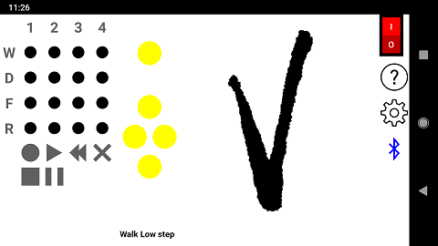

# Vorpal_Gamepad
app to replace Gamepad for Vorpal Hexapod

!!! This app is not associated in any way with the Vorpal Robotics Corporation !!!

The Vorpal Hexapod is a remote control six legged spider robot toy.
The web page is:
https://vorpalrobotics.com/wiki/index.php/Vorpal_The_Hexapod

The Vorpal Hexapod consists of the Robot itself, and a Gamepad to control the Robot remotely by bluetooth.

This is an Android app replacement for the Vorpal Gamepad.
The app works the same as the Gamepad and looks similar

## Getting Started

Get a Vorpal Robot, buy it or assemble it. You will need the Robot, but not the Gamepad. Please support Vorpal Robotics by buying from their store:
https://vorpal-robotics-store.myshopify.com/collections/hexapod-kits/products/vorpal-the-hexapod-opts

The Robot has an HC-05 Bluetooth receiver. If you bought the kit, the Gamepad and Robot will be paired. You do not want the HC-05 to be paired. Recommended is to buy a separate HC-05 and replace the one in the Robot (that way you can put back the original if you want).

You will need to pair your Android device with the Robot, turn on the Robot, and follow: https://support.google.com/android/answer/9075925?hl=en (do not connect)

### Prerequisites

This app requires at least Android 7.0 (Nougat)

### Installing

Make sure the Robot is off.

On your Android device:
Install the app from the Google Play Store.
Run the App
The message at the bottom will say "No Paired Device"
Click on the Settings gear icon on the right on the Settings page, find Bluetooth Devices, click on it.
There will be a list of all paired bluetooth devices, select the Robot.
On Bluetooth Speed, you can click on it to enter the speed that was set on your HC-05. the default is 9600, but the Vorpal HC-05 is set at 38400. There are several on line tutorials on how to change the speed of the HC-05
You can modify the other Preferences (recommended to leave Connect Automatically to on).
Return to the main screen.
Use the On/Off switch on the upper right to "turn on" the Gamepad.
The message should say No Connection and the Bluetooth icon will be black.
Turn on your Robot. Turn the indicator all the way clockwise to RC.
After a few seconds the Bluetooth icon should turn blue, and the message will change.

Now, you can use the app just like the Gamepad.
trim/recording/playing/ScratchX are all implemented
(see below for using ScratchX

### Guide

The app works just like the real Vorpal Gamepad, see the Guide at
http://vorpalrobotics.com/wiki/index.php/Vorpal_The_Hexapod_Gamepad_User_Guide

The right hand side has additional options:
- on/off button - this works like the power button on the Gamepad
- help - this brings up the Help page
- preferences - this brings up the Preferences page
- Bluetooth icon - displays the Bluetooth status, also starts and stops Bluetooth if the connect Bluetooth Automatically Preference is not set
- Status indicator - indicates the status of the app, trim, recording, etc.

On the bottom is a message line

## ScratchX

## Technical
This app uses
the Vorpal-Hexapod-Gamepad.ino file as a cpp file
file io directly from the cpp code
Bluetooth and ScratchX streaming io are handled using java code

## Building

This app is built with Android Studio

